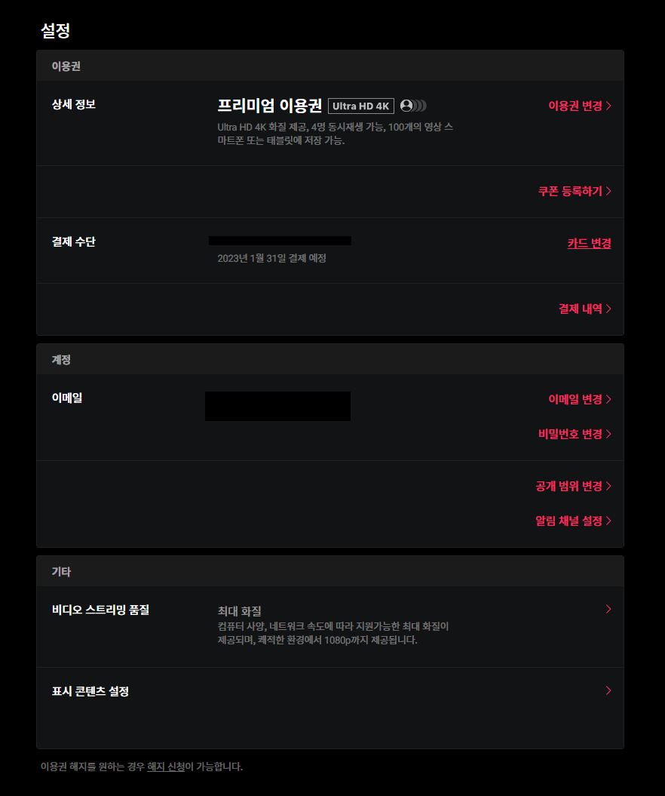
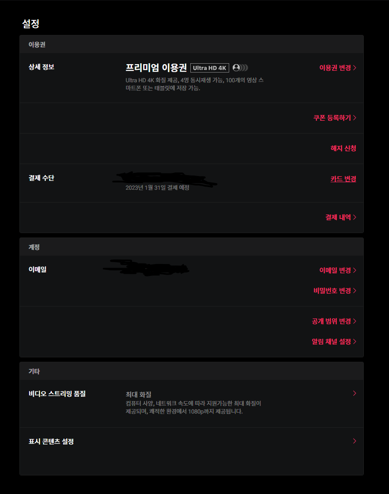
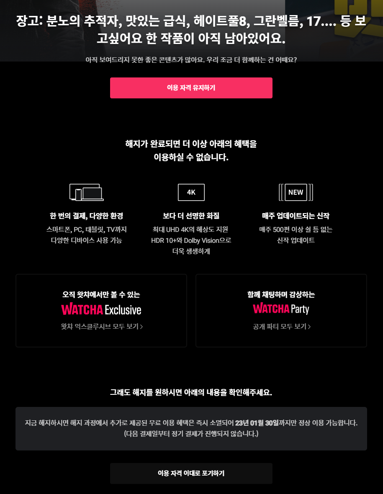
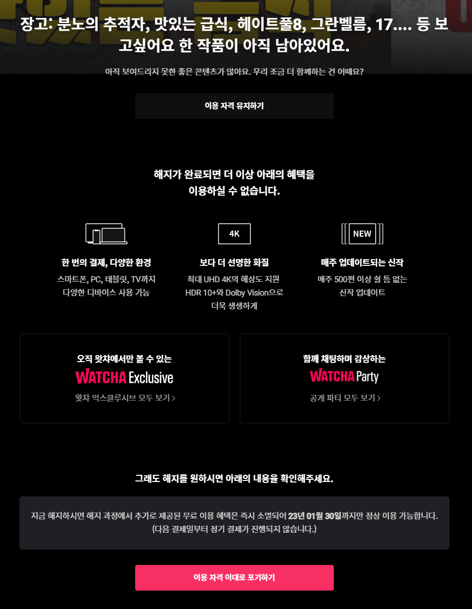

# decision-to-leave-watcha

왓챠 구독 해지 UI의 다크 패턴을 제거하는 브라우저용 유저스크립트입니다.

대부분의 코드는 ChatGPT에 의해 작성되었습니다. ([블로그 보기](https://www.seoco.me/92cf8380-f52f-44fc-a49a-c600b626a51c))

<table>
<tr>
<th style="text-align:center;">적용 전</th>
<th style="text-align:center;">적용 후</th>
</tr>
<tr>
<td>

</td>
<td>

</td>
</tr>
<tr>
<td>

</td>
<td>

</td>
</tr>
</table>

## 설치

1. [Violentmonkey](https://violentmonkey.github.io) 설치가 선행되어야 합니다.
1. [여기](https://greasyfork.org/scripts/459129)에서 스크립트를 설치합니다.

